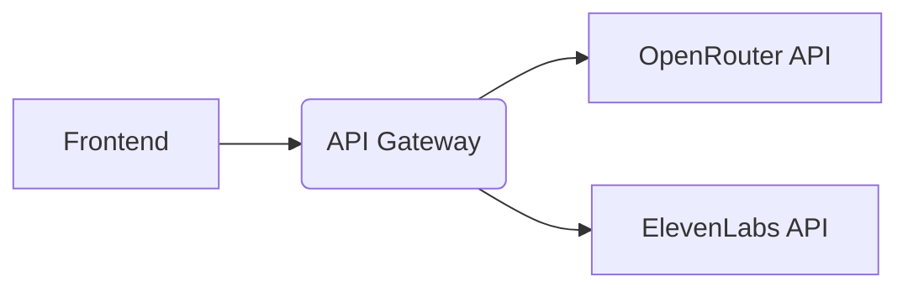
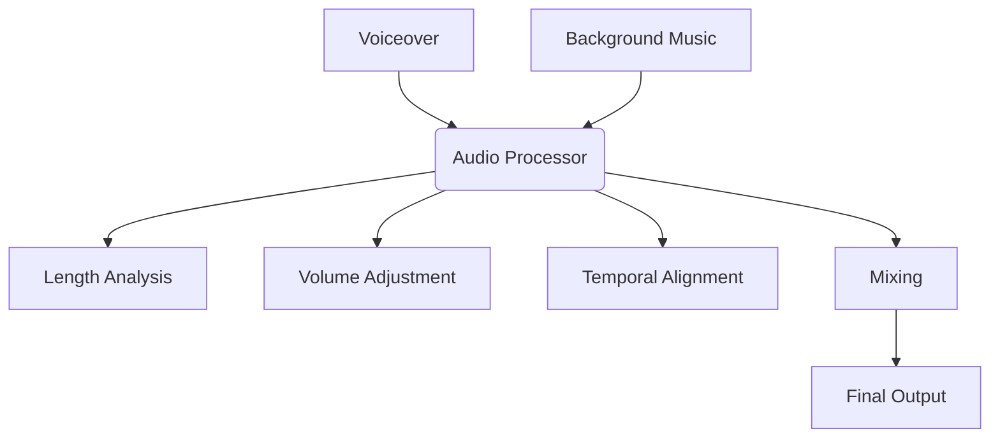

# Movie Trailer Generator - Design Blueprint

## Core Features

1. **AI-Powered Script Generation**
   - Generate movie titles and trailer scripts using LLM APIs
   - Support for multiple models/configurations
   - Random or theme-based generation

2. **Voice Synthesis**
   - Convert scripts to voiceovers using TTS API
   - Support for different voices/emotions
   - Audio file management

3. **Audio Processing Pipeline**
   - Background music management
   - Voiceover/music synchronization
   - Volume normalization and mixing
   - Audio stretching algorithms

4. **User Interface**
   - Theme selection/randomization
   - Generation controls
   - Audio playback
   - Error handling/status display

## User Interface Design (Figma Reference)

The user interface is designed for clarity, modularity, and ease of use, closely following the Figma design system:

### 1. Sidebar Navigation (Persistent)

- A vertical sidebar is present on **all pages** for consistent navigation.
- Sidebar includes primary actions: Generate, Listen, and Manage Keys.
- The active page is visually highlighted for orientation.
- Sidebar uses a light background with clear, accessible contrast.

### 2. Main Content Area

- Each page displays its main content to the right of the sidebar.
- Layout is centered with generous whitespace for focus and readability.

### 3. Manage Keys Page

- API keys are managed in **individual cards** with:
  - Info icon, bold API name, and required/optional status.
  - Full-width input for the key, with placeholder `{API_KEY}`.
  - Two buttons: `remove` and `save`, styled in lowercase and visually distinct.
  - Cards are separated with consistent spacing and rounded borders.
  - Supports Openrouter, Elevenlabs, and OpenAI Image-1 keys.

### 4. Generator UI

- Parameter selection uses a grid of cards for each movie element (title, genre, setting, character, conflict, plot twist).
- Each card has a single always-editable input field for its value, with a dropdown for quick selection if options exist. The Card value is always editable inline; there is no Edit button.
- A `Randomize all` button is provided for quick generation.
- The script generation area is visually separated, with clear call-to-action buttons.

### 5. Output & Results

- Latest outputs are shown in bordered cards, each displaying:
  - Movie title, parameters, and a movie poster.
  - Movie posters follow industry standard 2:3 portrait ratio (e.g., 200px × 300px, 400px × 600px).
  - Poster placeholder maintains the same 2:3 ratio while generation is pending.
  - Action buttons: Generate Poster, Regenerate, Download, View script.
- Layout is responsive and maintains clarity on various screen sizes.

### 6. Visual Consistency

- All components use a consistent border radius, spacing, and font hierarchy as defined in Figma.
- Button styles, input fields, and icons match the Figma reference for a cohesive look.

> **Note:** All UI changes and new pages must maintain the persistent sidebar navigation for a unified user experience.

## Architecture Components

### 1. API Integration Layer



### 2. Audio Processing Engine



### 3. State Management

- **Generation State Machine:**

  ```mermaid
  stateDiagram-v2
      Idle --> GeneratingScript: Start
      GeneratingScript --> GeneratingVoice: Success
      GeneratingScript --> Error: Failure
      GeneratingVoice --> MixingAudio: Success
      GeneratingVoice --> Error: Failure
      MixingAudio --> Ready: Success
      MixingAudio --> Error: Failure
      Error --> Idle: Reset
  ```

### 4. Configuration Management

- **Configuration Sources:**
  - Environment variables
  - Secret management (e.g., .env, secrets.toml)
  - User preferences
- **Configurable Parameters:**
  - API endpoints and keys
  - Default models
  - Audio processing parameters
  - Rate limits

### 5. Error Handling System

- **Circuit Breaker Pattern:**
  - Track consecutive failures
  - Disable service after threshold (e.g., 3 failures)
  - Automatic recovery after timeout (e.g., 5 minutes)
- **User Feedback:**
  - Clear error messages
  - Retry mechanisms
  - Service status indicators

## Key Design Decisions

1. **Movie Poster Standards**
   - Strict 2:3 portrait ratio for all posters (industry standard)
   - Default dimensions: 200px × 300px for thumbnails
   - High-res option: 400px × 600px for downloads/full view
   - Placeholder maintains ratio during loading states
   - OpenAI Image-1 API configured for 2:3 ratio output

2. **Audio Processing Approach**
   - Use dedicated audio processing library (pydub equivalent)
   - Avoid direct ffmpeg system calls
   - Implement intelligent stretching:
     - Slow down music for longer voiceovers
     - Speed up music for shorter voiceovers
   - Volume normalization: -20dB background reduction

3. **API Integration**
   - Abstract API clients behind interfaces
   - Implement request queuing for rate limiting
   - Support multiple AI providers via adapter pattern

4. **State Management**
   - Centralized state machine for generation workflow
   - Atomic operations with rollback capability
   - Status propagation to UI

5. **File Management**
   - Structured directory hierarchy:
     - `/assets/audio` - Source materials
     - `/generated_audio` - Output files
   - Consistent naming conventions:
     - `voiceover_<timestamp>.mp3`
     - `final_<timestamp>.mp3`

6. **Security**
   - Never store API keys in source code
   - Environment-based configuration
   - Secrets encryption in production

## Implementation Agnostic Patterns

1. **Abstract Components:**
   - `ScriptGenerator` interface
   - `VoiceSynthesizer` interface
   - `AudioMixer` interface

2. **Framework-Specific Adapters:**
   - UI Component Library
   - State Management Solution
   - Routing Mechanism

3. **Portable Core Logic:**
   - Pure JavaScript/TypeScript modules
   - Framework-independent services
   - Config-driven behavior

## Visual Style Guide Reference

All visual, branding, and UI work must adhere to the canonical style guide in `style-guide.md`. This document defines the color palette, font choices, accent usage, background blur effects, and other visual identity rules. Any new UI component or visual change should be checked against this guide for consistency.

## Project Documentation & References

- [Style Guide](style-guide.md): Visual and branding rules
- [Testing Guidelines](testing_guidelines.md): Comprehensive Jest testing standards and best practices

# API Integration & Model Selection

## Model Selection Guidelines
- Default to llama-3.3-70b-instruct for OpenRouter API calls
- Always confirm model selection before making API calls
- Never use paid models (like Claude) without explicit confirmation
- Document model choices in code comments and API integration files
- Include model-specific error handling

## Cost Efficiency
- Prefer free/lower-cost models when available
- Use llama-3.3-70b-instruct for general text generation
- Require explicit approval for using paid models
- Monitor and log API usage for cost tracking
